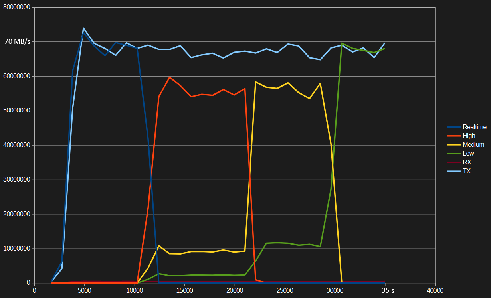

# C++ UDSP Socket (User Data Stream Protocol)

## How it works

### Level 0: UDP

- A single socket on the server side to connect to all clients.
- Blocking wait for new data from socket to minimize latency (`poll` in a separate thread).
- Pacing is implemented simply by frequently waking up the thread from blocking wait for
  packets to be received.

### Level 1: Connection and traffic control

- Implemented by feedback of losses and delays.

- PMTU discovery:
  - Start at 1200 bytes and at the Search Phase.
  - Back to the Search Phase after 10 minutes (RFC8899 DPLPMTUD, RFC4821)
- RX Loss:
  - TODO: Describe
- TX Loss:
  - TODO: Describe
- RTT:
  - TODO: Describe

### Level 2: Encryption

TODO: ML-KEM, X25519+ML-KEM768 | X25519MLKEM768, SecP256r1MLKEM768, SecP384r1MLKEM1024

### Level 3: Streams

- Streams are unidirectional.
- There can be up to 256 streams in both directions.
- The order of packets is guaranteed within one stream.
- Reliable and unreliable packet delivery is supported.
- The stream priority can be any of the available ones:
  - realtime (98 % of the channel, if ready to send)
  - high (80 %), medium (16 %), low (4 %)
- Each packet has its own specified timeout.
- TODO: ACK, SACK (Selective), FACK (Forward), DSACK (Duplicate Selective), RACK (Recent)

## API

TODO: Describe

### Connection

```cpp
// client
bool connect(const uint16_t port, const char* IPv4);
bool connect(const uint16_t port, const uint32_t IPv4);
bool disconnect();
bool isConnected() const;

// server
bool listen(const uint16_t port);

void setOnConnected(std::function<void(Connection*)>&& onConnected);
// reason:
//  'c' - closed
//  't' - timed out
//  'i' - interrupted
void setOnDisconnected(std::function<void(Connection*, char reason)>&& onDisconnected);
```

### Transfer

```cpp
// priority:
//  'R' - reliable realtime
//  'r' - unreliable realtime
//  'H' - reliable high
//  'h' - unreliable high
//  'M' - reliable medium (default)
//  'm' - unreliable medium
//  'L' - reliable low
//  'l' - unreliable low
//   0  - undefined
//NOTE: Calling it in the onDisconnected callback causes a deadlock!
void setTxStreamPriority(Connection* connection, uint8_t txStreamId, char priority = 'M');

// copy:
//   true - make an internal copy of the data
//   false - work with the data by a pointer
//NOTE: Calling it in the onDisconnected callback causes a deadlock!
bool send(uintptr_t context, Connection* connection, const void* data, uint64_t size_B,
    bool copy, uint8_t txStreamId = 0, uint32_t timeout_ms = 5000);

// status:
//  's' - success | sent
//  't' - timed out
//  'd' - disconnected
void setOnDelivered(Connection* connection, std::function<void(
    uintptr_t context, Connection* connection, const void* data, uint64_t size_B,
    uint8_t txStreamId, char status
)>&& onDelivered);

// status:
//  's' - success
//  'p' - piece
//  'l' - lost
//  't' - timed out
//  'd' - disconnected
void setOnReceived(Connection* connection, std::function<uintptr_t(
    uintptr_t context, Connection* connection, const void* data,
    uint64_t size_B, uint64_t offset_B, uint8_t rxStreamId, char status
)>&& onReceived);
```

### Settings

```cpp
// threshold_B:
//   packetSize_B <= threshold_B  -  size_B == packetSize_B, offset_B == 0
//   packetSize_B >  threshold_B  -  size_B <= packetSize_B, offset_B >= 0
void setRxPacketBufferSizeThreshold_B(const uint32_t threshold_B = 0x100000);

void setTxSpeedLimit_B_s(Connection* connection, uint32_t limit_B_s);
uint32_t getTxSpeedLimit_B_s(Connection* connection) const;

void setTestBandwidthState(const bool isEnabled = false);
bool getTestBandwidthState() const;
```

### Statistics

```cpp
uint32_t getRxSpeed_B_s(Connection* connection) const; // 1 Hz
uint32_t getTxSpeed_B_s(Connection* connection) const; // 1 Hz
float getRxLoss_prc(Connection* connection) const; // 1 Hz
float getTxLoss_prc(Connection* connection) const; // 1 Hz
uint32_t getRTT_us(Connection* connection) const; // 1 Hz
uint32_t getTPS() const; // 1 Hz
```


Sending 128'000 packets by 4 KiB (512 MiB in total) through 4 streams with different priorities for 35 s with 70 MB/s.

## Motivation

|                    | MQTT | QUIC             | UDT             | μTP                  | SCTP                          | WebRTC                               | UDSP |
| ------------------ | ---- | ---------------- | --------------- | -------------------- | ----------------------------- | ------------------------------------ | ---- |
| Traffic control    | TCP  | BBR, Cubic, Reno | Unnamed<br>AIMD | LEDBAT<br>(TCP-like) | Unnamed<br>(TCP-like)         | SCTP & SRTP                          | Proportional<br>loss & delay
| Reliable streams   | Yes  | Yes              | No              | Yes                  | Yes                           | Yes                                  | Yes
| Unreliable streams | No   | Partial*         | No              | No                   | Partial Reliability Extension | Yes*<br>Efficiency is not guaranteed | Yes
| Streams priority   | No   | No               | No              | No                   | Stream Scheduling Extension   | high*, medium, low, very-low         | real-time, high, medium, low
| Complexity         | Easy | Medium           | Low-level       | Low-level            | Medium                        | Hard*, 1.1 MLOC                      | Easy, 4 kLOC


TODO: Describe and compare
- TCP, kernel-space implementation, head-of-line blocking
- μTP - based on the congestion window  
  `dbScaledGain = MAX_CWND_INCREASE_BYTES_PER_RTT * dbDelayFactor * dbWindowFactor * nTimeElapse / rtt;`
- QUIC, UDT, SCTP, DCCP

## TODO

- Узкое место при передаче маленьких пакетов.
- Тесты с потерей пакетов.
- Чистка и оформление кода.
- Передача очень больших пакетов (onSend).
- Шифрование.
- IPv6.
- Миграция соединения.
- Maybe: WebRTC, TypeScript.
