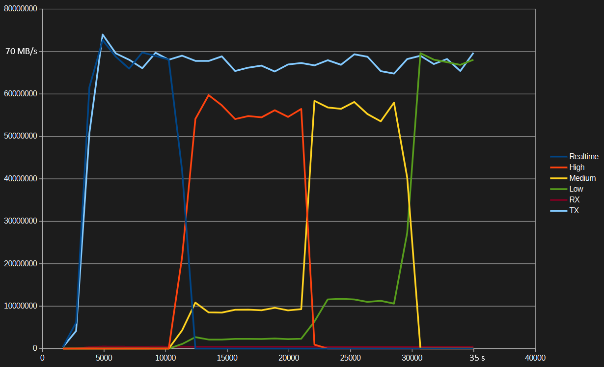

# C++ UDSP Socket (User Data Stream Protocol)

Designed for real-time data transmission through reliable and partially reliable (unreliable with ordering) streams with different priorities. A simple but efficient alternative to QUIC, SCTP, etc.

Currently, in an experimental but working state.


*Sending 512'000 packets by 4 KiB (2000 MiB in total) through 4 streams with different priorities for 35 s with 70 MB/s peak traffic (59.92 MB/s average throughput).*

## How it works

### Level 0: UDP

- A single socket on the server side to connect to all clients.
- Blocking wait for new data from socket to minimize latency (`poll` in a separate thread).
- Pacing is implemented simply by frequently waking up the thread from blocking wait for
  packets to be received.

### Level 1: Connection and traffic control

- Implemented by feedback of losses and delays.
- PMTU discovery:
  - Start at 1200 bytes and at the Search Phase.
  - Back to the Search Phase after 10 minutes (RFC8899 DPLPMTUD, RFC4821).
- RX Loss:
  - Calculated locally by detecting gaps in the packetNumber sequence within a defined packet window, which helps reduce reliance on packet reordering.
- TX Loss:
  - Received from the other side as a calculated packet loss percentages.
- RTT:
  - Continuously measured through RTTRequest/RTTResponse exchanges, subtracting the processing time. An exponentially smoothed RTT is then calculated, to filter out a network jitter.
- Good congestion conditions:
  - `TX loss <= 1 %` and `RTT <= minRTT * kAllowedRTT`(5).
  - The larger `kAllowedRTT` - the higher maximum throughput, but also the greater connection latency.
- When congestion conditions are bad for 16 times in a row:
  - Find a new target `minRTT` by temporarily reducing traffic to 65 %.
- Traffic control:
  - Proportional increasing (`+= previous / kIncStep`(256)) when congestion conditions is good.
  - Proportional decreasing (`-= previous / kDecStep`(128)) otherwise.

UDSP header (26 bytes):
```
0                   1                   2                   3
0 1 2 3 4 5 6 7 8 9 0 1 2 3 4 5 6 7 8 9 0 1 2 3 4 5 6 7 8 9 0 1
+-+-+-+-+-+-+-+-+-+-+-+-+-+-+-+-+-+-+-+-+-+-+-+-+-+-+-+-+-+-+-+-+
|                     packetId (32-bit enum)                    |
+-+-+-+-+-+-+-+-+-+-+-+-+-+-+-+-+-+-+-+-+-+-+-+-+-+-+-+-+-+-+-+-+
|                     packetNumber (uint32_t)                   |
+-+-+-+-+-+-+-+-+-+-+-+-+-+-+-+-+-+-+-+-+-+-+-+-+-+-+-+-+-+-+-+-+
|                     connectionId (uint64_t)                   |
+-+-+-+-+-+-+-+-+-+-+-+-+-+-+-+-+-+-+-+-+-+-+-+-+-+-+-+-+-+-+-+-+
|                              ...                              |
+-+-+-+-+-+-+-+-+-+-+-+-+-+-+-+-+-+-+-+-+-+-+-+-+-+-+-+-+-+-+-+-+
|   PMTUProbeSize_B (uint16_t)  | packetsLoss_prc100 (uint16_t) |
+-+-+-+-+-+-+-+-+-+-+-+-+-+-+-+-+-+-+-+-+-+-+-+-+-+-+-+-+-+-+-+-+
|                     RTTDelay_us (uint32_t)                    |
+-+-+-+-+-+-+-+-+-+-+-+-+-+-+-+-+-+-+-+-+-+-+-+-+-+-+-+-+-+-+-+-+
|   RTTRequest  |  RTTResponse  |                               :
|   (uint8_t)   |   (uint8_t)   |                               :
+-+-+-+-+-+-+-+-+-+-+-+-+-+-+-+-+                               :
|                                                               :
:                             chunks                            :
:                                                               |
+-+-+-+-+-+-+-+-+-+-+-+-+-+-+-+-+-+-+-+-+-+-+-+-+-+-+-+-+-+-+-+-+
```

### Level 2: Encryption

TODO: ML-KEM, X25519+ML-KEM768 | X25519MLKEM768, SecP256r1MLKEM768, SecP384r1MLKEM1024

### Level 3: Streams

- Streams are unidirectional.
- There can be up to 256 streams in both directions.
- The order of packets is guaranteed within one stream.
- Reliable and unreliable packet delivery is supported.
- The stream priority can be any of the available ones:
  - realtime (98 % of the channel, if ready to send)
  - high (80 %), medium (16 %), low (4 %)
- Each packet has its own specified timeout.
- When a loss is detected, the receiver sends a position to repeat the transmission from it (SACK+NACK-like).

Chunk variants:
- SmallPacket (Type = 0)
```
0      A=0          1                   2                   3
0 1 2 3 4 5 6 7 8 9 0 1 2 3 4 5 6 7 8 9 0 1 2 3 4 5 6 7 8 9 0 1
+-+-+-+-+-+-+-+-+-+-+-+-+-+-+-+-+-+-+-+-+-+-+-+-+-+-+-+-+-+-+-+-+
| T | |A|R|F|PS | streamId (u8) |      packetId (uint32_t)      |
+-+-+-+-+-+-+-+-+-+-+-+-+-+-+-+-+-+-+-+-+-+-+-+-+-+-+-+-+-+-+-+-+
|              ...              |    packetSize_B (PS bytes)    |
+-+-+-+-+-+-+-+-+-+-+-+-+-+-+-+-+-+-+-+-+-+-+-+-+-+-+-+-+-+-+-+-+
|                   data (packetSize_B bytes)                   |
+-+-+-+-+-+-+-+-+-+-+-+-+-+-+-+-+-+-+-+-+-+-+-+-+-+-+-+-+-+-+-+-+
```
```
0      A=1          1                   2                   3
0 1 2 3 4 5 6 7 8 9 0 1 2 3 4 5 6 7 8 9 0 1 2 3 4 5 6 7 8 9 0 1
+-+-+-+-+-+-+-+-+-+-+-+-+-+-+-+-+-+-+-+-+-+-+-+-+-+-+-+-+-+-+-+-+
| T | |A|R|F|PS | streamId (u8) |      packetId (uint32_t)      |
+-+-+-+-+-+-+-+-+-+-+-+-+-+-+-+-+-+-+-+-+-+-+-+-+-+-+-+-+-+-+-+-+
|              ...              |
+-+-+-+-+-+-+-+-+-+-+-+-+-+-+-+-+
```
- BeginOfPacket (Type = 1)
```
0                   1                   2                   3
0 1 2 3 4 5 6 7 8 9 0 1 2 3 4 5 6 7 8 9 0 1 2 3 4 5 6 7 8 9 0 1
+-+-+-+-+-+-+-+-+-+-+-+-+-+-+-+-+-+-+-+-+-+-+-+-+-+-+-+-+-+-+-+-+
| T |   |R|F|PS | streamId (u8) |      packetId (uint32_t)      |
+-+-+-+-+-+-+-+-+-+-+-+-+-+-+-+-+-+-+-+-+-+-+-+-+-+-+-+-+-+-+-+-+
|              ...              |    packetSize_B (PS bytes)    |
+-+-+-+-+-+-+-+-+-+-+-+-+-+-+-+-+-+-+-+-+-+-+-+-+-+-+-+-+-+-+-+-+
|                  reserved (CRC32) (uint32_t)                  |
+-+-+-+-+-+-+-+-+-+-+-+-+-+-+-+-+-+-+-+-+-+-+-+-+-+-+-+-+-+-+-+-+
```
- PieceOfPacket (Type = 2)
```
0                   1                   2                   3
0 1 2 3 4 5 6 7 8 9 0 1 2 3 4 5 6 7 8 9 0 1 2 3 4 5 6 7 8 9 0 1
+-+-+-+-+-+-+-+-+-+-+-+-+-+-+-+-+-+-+-+-+-+-+-+-+-+-+-+-+-+-+-+-+
| T |R|F| O |PS | streamId (u8) |      packetId (uint32_t)      |
+-+-+-+-+-+-+-+-+-+-+-+-+-+-+-+-+-+-+-+-+-+-+-+-+-+-+-+-+-+-+-+-+
|              ...              |       offset_B (O bytes)      |
+-+-+-+-+-+-+-+-+-+-+-+-+-+-+-+-+-+-+-+-+-+-+-+-+-+-+-+-+-+-+-+-+
|     pieceSize_B (PS bytes)    |    data (pieceSize_B bytes)   |
+-+-+-+-+-+-+-+-+-+-+-+-+-+-+-+-+-+-+-+-+-+-+-+-+-+-+-+-+-+-+-+-+
```
- RepeatInfo (Type = 3)
```
0                   1                   2                   3
0 1 2 3 4 5 6 7 8 9 0 1 2 3 4 5 6 7 8 9 0 1 2 3 4 5 6 7 8 9 0 1
+-+-+-+-+-+-+-+-+-+-+-+-+-+-+-+-+-+-+-+-+-+-+-+-+-+-+-+-+-+-+-+-+
| T |   |RO |RS | streamId (u8) |      packetId (uint32_t)      |
+-+-+-+-+-+-+-+-+-+-+-+-+-+-+-+-+-+-+-+-+-+-+-+-+-+-+-+-+-+-+-+-+
|              ...              |   repeatOffset_B (RO bytes)   |
+-+-+-+-+-+-+-+-+-+-+-+-+-+-+-+-+-+-+-+-+-+-+-+-+-+-+-+-+-+-+-+-+
|                    repeatSize_B (RS bytes)                    |
+-+-+-+-+-+-+-+-+-+-+-+-+-+-+-+-+-+-+-+-+-+-+-+-+-+-+-+-+-+-+-+-+
```

## API

### Connection

```cpp
// client
bool connect(const uint16_t port, const IPAddress& address);
bool disconnect();
bool isConnected() const;

// server
bool listen(const uint16_t port);

void setOnConnected(std::function<void(Connection*)>&& onConnected);
// reason:
//  'c' - closed
//  't' - timed out
//  'i' - interrupted
void setOnDisconnected(std::function<void(Connection*, char reason)>&& onDisconnected);
```

### Transfer

```cpp
// priority:
//  'R' - reliable realtime
//  'r' - unreliable realtime
//  'H' - reliable high
//  'h' - unreliable high
//  'M' - reliable medium (default)
//  'm' - unreliable medium
//  'L' - reliable low
//  'l' - unreliable low
//   0  - undefined
//NOTE: Calling it in the onDisconnected callback causes a deadlock!
void setTxStreamPriority(Connection* connection, uint8_t txStreamId, char priority = 'M');

// copy:
//   true - make an internal copy of the data
//   false - work with the data by a pointer
//NOTE: Calling it in the onDisconnected callback causes a deadlock!
bool send(uintptr_t context, Connection* connection, const void* data, uint64_t size_B,
    bool copy, uint8_t txStreamId = 0, uint32_t timeout_ms = 5000);

// status:
//  's' - success | sent
//  't' - timed out
//  'd' - disconnected
void setOnDelivered(Connection* connection, std::function<void(
    uintptr_t context, Connection* connection, const void* data, uint64_t size_B,
    uint8_t txStreamId, char status
)>&& onDelivered);

// status:
//  's' - success
//  'p' - piece
//  'l' - lost
//  't' - timed out
//  'd' - disconnected
void setOnReceived(Connection* connection, std::function<uintptr_t(
    uintptr_t context, Connection* connection, const void* data,
    uint64_t size_B, uint64_t offset_B, uint8_t rxStreamId, char status
)>&& onReceived);
```

### Settings

```cpp
// threshold_B:
//   packetSize_B <= threshold_B  -  size_B == packetSize_B, offset_B == 0
//   packetSize_B >  threshold_B  -  size_B <= packetSize_B, offset_B >= 0
void setRxPacketBufferSizeThreshold_B(const uint32_t threshold_B = 0x100000);

void setTxSpeedLimit_B_s(Connection* connection, uint32_t limit_B_s);
uint32_t getTxSpeedLimit_B_s(Connection* connection) const;

void setTestBandwidthState(const bool isEnabled = false);
bool getTestBandwidthState() const;
```

### Statistics

```cpp
uint32_t getRxSpeed_B_s(Connection* connection) const; // 1 Hz
uint32_t getTxSpeed_B_s(Connection* connection) const; // 1 Hz
float getRxLoss_prc(Connection* connection) const; // 1 Hz
float getTxLoss_prc(Connection* connection) const; // 1 Hz
uint32_t getRTT_us(Connection* connection) const; // 1 Hz
uint32_t getTPS() const; // 1 Hz
```

## Motivation

|                    | MQTT     | UDT             | μTP                  | QUIC                 | SCTP                          | WebRTC                       | UDSP                             |
| ------------------ | -------- | --------------- | -------------------- | -------------------- | ----------------------------- | ---------------------------- | -------------------------------- |
| Traffic control    | *TCP*    | Unnamed<br>AIMD | LEDBAT<br>(TCP-like) | **BBR**, Cubic, Reno | AIMD<br>**loss & delay**      | **SCTP** & SRTP              | **Proportional<br>loss & delay** |
| Reliable streams   | **Yes**  | *No*            | **Yes**              | **Yes**              | **Yes**                       | **Yes**                      | **Yes**                          |
| Unreliable streams | *No*     | *No*            | *No*                 | Partial*             | Partial Reliability Extension | **Yes\***                    | **Yes**                          |
| Streams priority   | *No*     | *No*            | *No*                 | *No*                 | Stream Scheduling Extension   | high*, medium, low, very-low | **real-time, high, medium, low** |
| Complexity         | **Easy** | Low-level       | Low-level            | Medium               | Medium                        | *Hard\*, 1.1 MLOC*           | **Easy, 4 kLOC**                 |

- Any TCP‑based variants (like MQTT) suffer from the head‑of‑line blocking problem, which is fatal for real-time applications. In addition, adding RTT feedback support (like C2TCP) is problematic, since TCP is usually implemented in OS-kernel.
- UDT is essentially just basic packet transmission, like TCP, and is suitable only for bulk data transfer over high-speed WANs using AIMD.
- μTP was originally designed as a background transport protocol (e.g., BitTorrent) based on delay. It heavily yields to other traffic, making it unsuitable for highly aggressive, real-time data needs.  
  `dbScaledGain = MAX_CWND_INCREASE_BYTES_PER_RTT * dbDelayFactor * dbWindowFactor * nTimeElapse / rtt;`
- QUIC has built‑in support for streams with guaranteed delivery, but, to transmit without delivery guarantees, you either need to find protocol extensions, or implement it yourself, by using leftover space in datagrams. In the second case, stream prioritization becomes significantly harder to implement.
- SCTP supports the required functionality only via extensions, which must still be made interoperable with one another.
- In WebRTC, to achieve streams without guaranteed delivery, you can set parameter `maxRetransmits=0` or `maxPacketLifeTime=0`, which works well. However, the maximum difference between the highest and lowest stream priorities is only 8x (high=4, medium=2, low=1, very‑low=0.5). Also, beyond data transmission, WebRTC includes: audio and video codecs; suppression algorithms for echo, noise, jitter; and a NAT traversal subsystem (STUN, TURN, ICE).
- UDSP was originally designed with built‑in support for all required features (streams with and without delivery guarantees, stream prioritization, efficient traffic control), with an emphasis on simplicity.

## TODO

- Transmitting of huge packets (onSend).
- Encryption.
- IPv6.
- Connection migration.
- Maybe: WebRTC, TypeScript.
